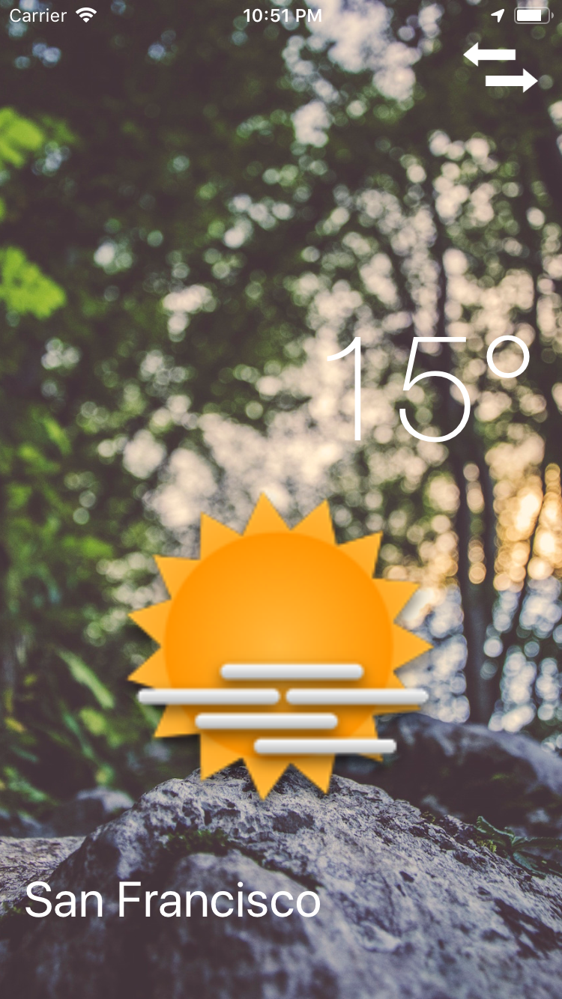

# ClimaApp
simple iOS Weather app

 

Very simple iOS Weather app 

Technologies: 
  * Xcode, Interface Builder,Segues
  * Storyboards, Layouts
  * Swift(Delegates & Protocols, OOP, MVC, Arrays, Dictionaries)
  * API calls, JSON, JSON Parsing, 
  * Cocoapods, Alamofire, SwiftyJSON...
  * CoreLocation Framework
  
